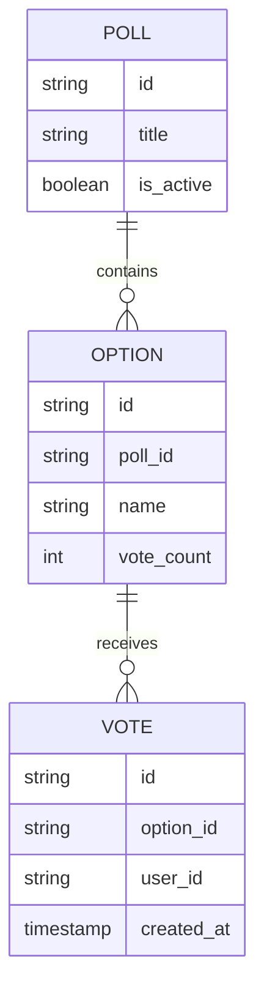
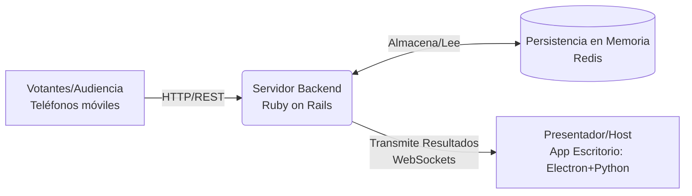
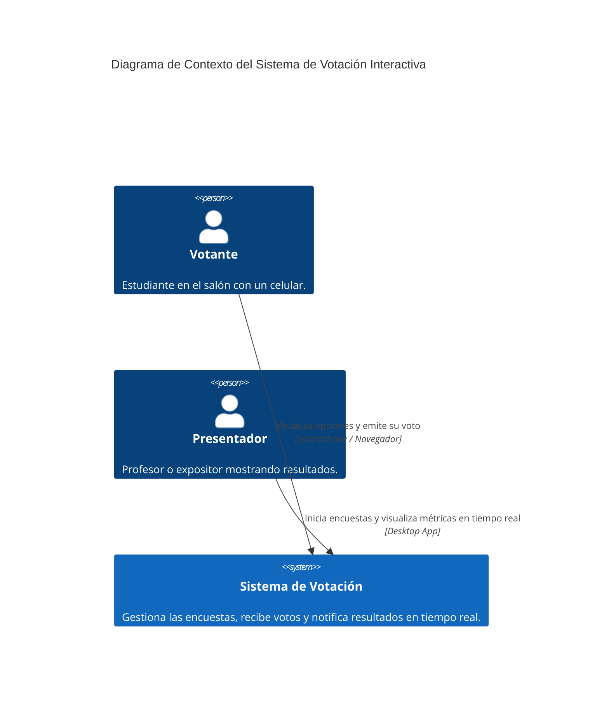
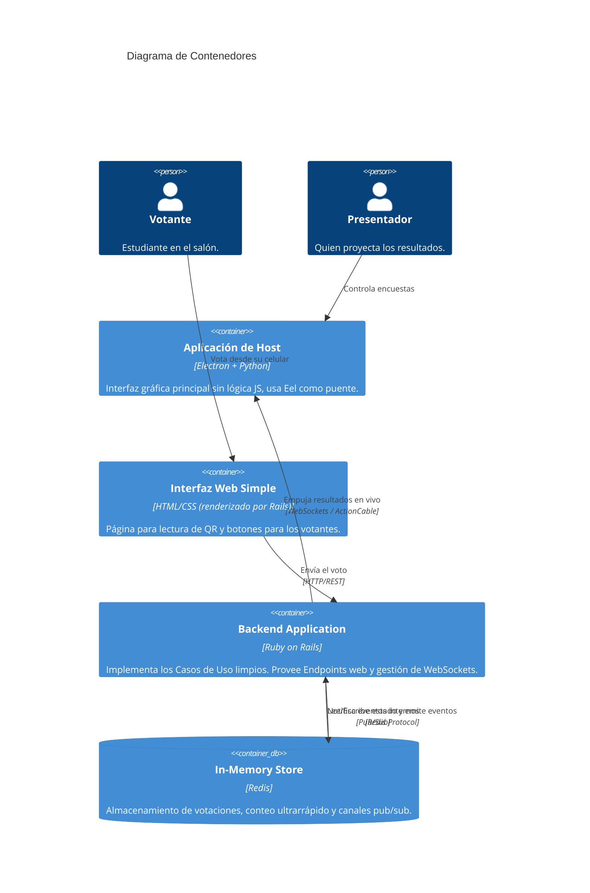
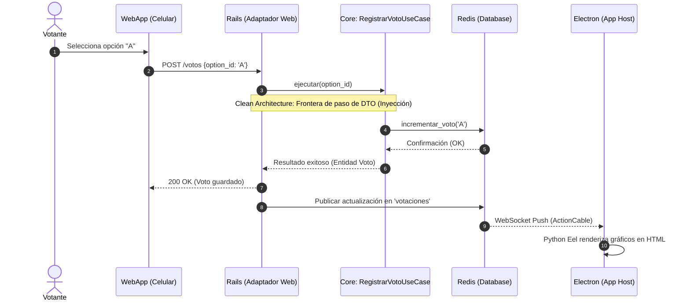
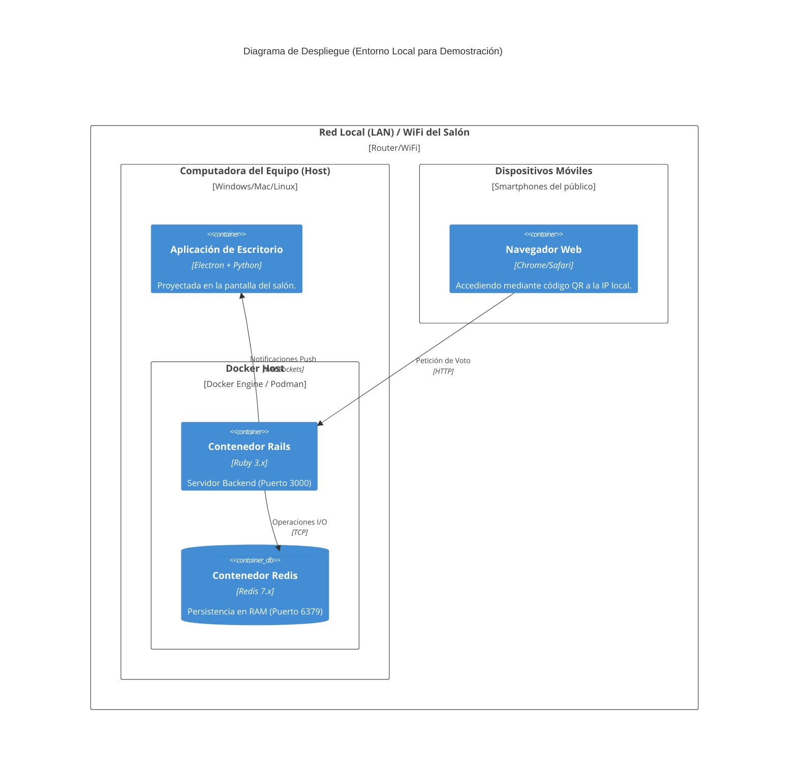

# Sistema de Votación Interactiva en Tiempo Real (G3)
## Documento Técnico y de Arquitectura

**Estilo Arquitectónico:** Clean Architecture
**Stack Tecnológico:**
*   **Frontend:** Electron + Python (Eel)
*   **Backend:** Ruby on Rails
*   **Persistencia:** Redis
*   **Integración:** WebSockets (ActionCable)

---

## 1. Investigación del Estilo y Stack

### 1.1. Estilo Arquitectónico: Clean Architecture

*   **Definición clara:** Es un modelo de diseño de software que estructura el sistema en capas concéntricas, garantizando que el dominio y las reglas de negocio permanezcan en el núcleo, aislados de los detalles de infraestructura. Su pilar es la "Regla de Dependencia", la cual dicta que las dependencias del código fuente siempre deben apuntar hacia el centro. A diferencia de un framework, una plantilla de directorios o un patrón a nivel de clases, Clean Architecture es estrictamente un paradigma arquitectónico abstracto enfocado en la gestión de dependencias.
*   **Clasificación del estilo**
    Se clasifica como un estilo arquitectónico **estructural** y pertenece a la familia de arquitecturas basadas en la *Separación de Intereses (Separation of Concerns)* y *Puertos y Adaptadores*, siendo una evolución de la Arquitectura Hexagonal y la Onion Architecture.
*   **Características principales**
    Garantiza independencia de frameworks, de la interfaz de usuario y de las bases de datos. Asimismo, fomenta una alta testabilidad, permitiendo ejecutar pruebas unitarias sobre la lógica de negocio sin requerir bases de datos o servidores web activos.
*   **Historia y evolución**
    Fue formalizada en 2012 por Robert C. Martin ("Uncle Bob"). Surgió como respuesta a los problemas de mantenimiento generados por arquitecturas altamente acopladas a la base de datos o al framework web, consolidando los principios introducidos previamente por la Arquitectura Hexagonal (Alistair Cockburn, 2005) y la Onion Architecture (Jeffrey Palermo, 2008).
*   **Ventajas y desventajas**
    *   *Ventajas:* Alta mantenibilidad y extensibilidad a largo plazo. Permite la sustitución de componentes tecnológicos (como migrar de una base de datos relacional a una en memoria) sin alterar el núcleo del negocio.
    *   *Desventajas:* Curva de aprendizaje elevada. Genera complejidad accidental y verbosidad en etapas tempranas debido a la necesidad de crear interfaces, mapeadores y DTOs, lo que retrasa el *Time to Market* inicial.
*   **Problemas comunes que se presentan y patrones**
    El problema más frecuente es la filtración de detalles de infraestructura hacia el dominio (ej. modelos del ORM viajando a las vistas). Para mitigar esto, se emplea el patrón **DTO (Data Transfer Object)**. Otro problema es el alto acoplamiento en la instanciación, el cual se resuelve mediante la **Inyección de Dependencias (IoC)**.
*   **Identificar patrones aplicables y cuándo usarlos**
    *   *Inyección de Dependencias:* Se aplica sistemáticamente para proveer las implementaciones de repositorios y servicios externos a los Casos de Uso.
    *   *Patrón Repositorio:* Se utiliza para abstraer la persistencia subyacente (Redis), exponiendo contratos (interfaces) que el dominio comprende, sin exponer la tecnología específica.
*   **Casos de uso:** Su aplicación es ideal en sistemas de nivel empresarial (Enterprise), dominios de negocio complejos y proyectos con expectativa de vida prolongada donde la tecnología externa sea susceptible a cambios. Por el contrario, resulta excesivo y contraproducente en prototipos rápidos (MVPs), aplicaciones de vida corta o sistemas CRUD simples, donde un patrón MVC tradicional ofrecería suficiente robustez con un menor costo de desarrollo inicial.
*   **Casos de aplicación (ejemplos reales en la industria)**
    Adoptado frecuentemente en el sector FinTech (ej. N26, Nubank) y en la arquitectura de microservicios de plataformas de alto tráfico (ej. Netflix, Uber), donde el aislamiento de la lógica core permite realizar actualizaciones de infraestructura sin interrumpir las transacciones comerciales.

### 1.2. Tecnologías del Stack Asignado

#### Frontend: Electron + Python (Eel)
*   **Definición clara:** Electron es un framework para construir aplicaciones de escritorio nativas utilizando tecnologías web, mientras que Eel es una biblioteca que sirve de puente entre Python y el motor Chromium, permitiendo gestionar la interfaz web directamente desde el backend en Python. No se trata de un entorno para alojar páginas web públicas ni genera ejecutables en código máquina puro, sino que opera levantando una instancia embebida de un navegador web.
*   **Características principales:** Es multiplataforma (Windows, macOS, Linux) y otorga acceso a recursos locales del sistema operativo. En este contexto, permite prescindir del uso de JavaScript para la lógica de presentación.
*   **Historia y evolución:** Electron fue desarrollado por GitHub en 2013 como base para el editor Atom. Eel surgió posteriormente para cubrir la necesidad de los desarrolladores de Python de crear interfaces gráficas modernas, superando las limitaciones visuales de librerías tradicionales como Tkinter.
*   **Ventajas y desventajas:** Su principal ventaja es la reutilización del ecosistema web (HTML/CSS) combinado con la potencia de procesamiento de Python. Su mayor desventaja es el alto consumo de recursos (memoria RAM) debido al motor de Chromium embebido.
*   **Casos de uso:** Está altamente recomendado para el desarrollo de herramientas internas corporativas, dashboards analíticos y editores de código multiplataforma. Sin embargo, su arquitectura basada en Chromium lo hace inadecuado para aplicaciones que requieran un consumo mínimo de memoria RAM o renderizado de gráficos 3D intensivos.
*   **Casos de aplicación:** Plataformas de comunicación como Slack, Discord y WhatsApp Desktop, y editores como Visual Studio Code.

#### Backend: Ruby on Rails
*   **Definición clara:** Es un framework de desarrollo web en el lado del servidor, escrito en Ruby y estructurado bajo el paradigma Modelo-Vista-Controlador (MVC). A diferencia de lenguajes de programación independientes o Sistemas de Gestión de Contenidos (CMS) autoinstalables como WordPress, Rails proporciona un esqueleto completo de herramientas para construir aplicaciones web a medida desde cero.
*   **Características principales:** Promueve los principios de "Convención sobre Configuración" (CoC) y "No te repitas" (DRY), agilizando el desarrollo al tomar decisiones arquitectónicas por defecto.
*   **Historia y evolución:** Creado por David Heinemeier Hansson (DHH) en 2003 durante el desarrollo de Basecamp. Popularizó el desarrollo ágil de aplicaciones web y estandarizó múltiples convenciones modernas.
*   **Ventajas y desventajas:** Destaca por su extrema velocidad para construir aplicaciones funcionales. Su desventaja en contextos de Clean Architecture es su tendencia al acoplamiento profundo (especialmente mediante ActiveRecord), exigiendo un esfuerzo adicional para separar el dominio del framework.
*   **Casos de uso:** Resulta ideal para el lanzamiento de Startups, plataformas SaaS y APIs RESTful de rápido crecimiento que requieren alta velocidad de iteración. En contraste, pierde eficiencia en dominios que exigen procesos de Machine Learning intensivos o cálculos paralelos masivos, donde otros ecosistemas tienen mayor especialización.
*   **Casos de aplicación:** Plataformas globales como GitHub, Shopify, Twitch y Airbnb (en sus inicios).

#### Persistencia: Redis
*   **Definición clara:** Es un motor de estructura de datos en memoria (In-Memory), de código abierto, empleado frecuentemente como base de datos de latencia ultra baja, caché y bróker de mensajes. Se diferencia de las bases de datos relacionales tradicionales en que no opera con sentencias SQL complejas ni está diseñado como un almacenamiento primario persistente en disco para archivar volúmenes masivos de datos históricos inactivos.
*   **Características principales:** Estructura basada en clave-valor, tiempos de respuesta submilimétricos y soporte integral para arquitecturas guiadas por eventos mediante el patrón de Publicación/Suscripción (Pub/Sub).
*   **Historia y evolución:** Desarrollado en 2009 por Salvatore Sanfilippo ante la necesidad de mejorar el rendimiento en tiempo real de su plataforma de analíticas web, superando las latencias de las bases de datos en disco.
*   **Ventajas y desventajas:** Proporciona un rendimiento insuperable para operaciones de lectura/escritura. Su limitación principal es el costo operativo, dado que el almacenamiento en RAM es significativamente más caro que el almacenamiento en disco.
*   **Casos de uso:** Es óptimo para implementar tableros de puntuación en vivo (Leaderboards), gestión distribuida de sesiones web, votaciones interactivas en tiempo real y sistemas de caché de alta velocidad. Debido a la volatilidad y costo de la memoria RAM, no debe ser empleado como la única fuente de verdad para transacciones contables o datos relacionales críticos a largo plazo.
*   **Casos de aplicación:** Arquitecturas de tiempo real en empresas como Twitter, Pinterest y StackOverflow.

#### Protocolo de Integración: WebSockets (ActionCable)
*   **Definición clara:** Es un protocolo de comunicación informático que proporciona canales full-duplex bidireccionales sobre una única conexión TCP persistente de larga duración. Rompe con el ciclo tradicional de petición-respuesta de HTTP, ya que permite que la conexión permanezca abierta, posibilitando al servidor enviar información al cliente en cualquier momento sin esperar una petición previa.
*   **Características principales:** Facilita la transmisión de datos con latencias mínimas y elimina el overhead de red al evitar encabezados repetitivos.
*   **Historia y evolución:** Estandarizado por la IETF en 2011 (RFC 6455) para reemplazar técnicas ineficientes como el "long-polling", permitiendo verdaderas aplicaciones web reactivas.
*   **Ventajas y desventajas:** Permite arquitecturas altamente reactivas. La desventaja radica en la complejidad de infraestructura necesaria para mantener miles de conexiones TCP simultáneas y el manejo de reconexiones.
*   **Casos de uso:** Su implementación es obligatoria para plataformas reactivas como sistemas de trading, aplicaciones de chat en vivo y sistemas de participación en tiempo real (como encuestas interactivas). Por la complejidad de infraestructura que conlleva, resulta un sobrecosto innecesario si el objetivo es simplemente servir contenido estático o realizar cargas asíncronas no críticas.
*   **Casos de aplicación:** Mensajería instantánea (WhatsApp Web), plataformas financieras (Binance) y colaboración en tiempo real (Google Docs).

### 1.3. Relación entre el estilo y las tecnologías seleccionadas
*   **Relación entre tecnologías (Análisis de mercado):** Se identifican dos ecosistemas contrastantes. Por un lado, la integración de **Rails, Redis y WebSockets (ActionCable)** representa un estándar industrial sumamente maduro y cohesivo. Por el contrario, el uso de **Electron operado mediante Python** representa un nicho especializado. La integración de ambos polos mediante un protocolo de red (WebSockets) da como resultado un sistema distribuido heterogéneo.
*   **Relación con Clean Architecture:** Precisamente la naturaleza heterogénea de este stack obliga a implementar las restricciones de Clean Architecture. Al residir la interfaz de usuario (Python) y el servidor (Ruby) en entornos aislados, se garantiza una separación física y lógica. Asimismo, se requiere delimitar la responsabilidad de Rails para que actúe exclusivamente como mecanismo de entrega (Delivery Mechanism), y la de Redis como adaptador de persistencia, resguardando la lógica core en entidades y casos de uso abstractos.

### 1.4. Frameworks: Comandos, Estructura y Variables de Entorno

**Backend: Ruby on Rails**
*   **Comandos de creación:** 
    *   `rails new backend_votacion --api` (Crea un proyecto Rails en modo API, omitiendo las vistas HTML tradicionales).
    *   `rails generate controller Votos` (Genera el controlador base).
*   **Estructura de archivos:**
    *   Por convención, Rails usa `app/controllers`, `app/models`, `app/views`. 
    *   *Adaptación Clean Architecture:* Crearemos nuevas carpetas: `app/core/entities` (entidades de negocio puras) y `app/core/use_cases` (lógica de negocio). Rails quedará relegado a `app/controllers` y a `app/infrastructure` para la persistencia.
*   **Manejo de variables de entorno:** Rails utiliza `ENV['REDIS_URL']` o archivos como `.env` (con la gema `dotenv-rails`) y las credenciales encriptadas en `config/credentials.yml.enc` para proteger contraseñas y URLs de la base de datos.

**Frontend: Electron + Python (Eel)**
*   **Comandos de creación:** 
    *   `pip install eel` (Instala la librería).
    *   `python -m eel main.py web --onefile` (Comando para empaquetar y compilar la aplicación en un ejecutable usando PyInstaller, cumpliendo con la necesidad de despliegue).
*   **Estructura de archivos:**
    *   `main.py`: Archivo principal de Python que levanta la ventana, interactúa con el SO y maneja la conexión WebSockets con Rails.
    *   `web/`: Carpeta que contiene `index.html` y `style.css` (sin lógica JS).
*   **Manejo de variables de entorno:** Se utiliza la librería `python-dotenv` cargando un archivo `.env` para almacenar la IP o URL del servidor Rails al cual conectarse vía WebSocket (ej. `WS_SERVER_URL=ws://localhost:3000/cable`).

---

## 2. Análisis Arquitectónico

A continuación se presentan las matrices de análisis para evaluar cómo Clean Architecture y el stack tecnológico seleccionado impactan el desarrollo del sistema de votación.

### 2.1. Matriz de Atributos de Calidad vs Estilo

| Atributo de Calidad | ¿El estilo (Clean) lo soporta o limita? | Justificación |
| :--- | :--- | :--- |
| **Mantenibilidad** | **Lo soporta (Alto)** | Separar el dominio de la infraestructura facilita localizar errores y realizar actualizaciones sin afectar otras capas. |
| **Testabilidad** | **Lo soporta (Alto)** | Los Casos de Uso y Entidades se pueden probar unitariamente al 100% aislando Rails y Redis mediante *Mocks*. |
| **Flexibilidad / Interoperabilidad** | **Lo soporta (Alto)** | Permite cambiar la UI (ej. de web a móvil) o la persistencia (de Redis a PostgreSQL) sin reescribir la lógica de negocio. |
| **Rendimiento (Performance)** | **Lo limita (Leve)** | El paso estricto de datos entre capas (usando DTOs) añade un pequeño *overhead* computacional en comparación con consultas directas acopladas. |
| **Simplicidad (Time to Market)** | **Lo limita (Alto)** | Exige crear muchas clases, interfaces y archivos para operaciones simples, ralentizando la velocidad de desarrollo en fases iniciales. |

### 2.2. Matriz de Análisis de Principios vs Estilo

| Principio | ¿El estilo lo cumple? | Justificación |
| :--- | :--- | :--- |
| **SOLID (SRP, OCP, LSP, ISP, DIP)** | **Sí (Altamente)** | Clean Architecture está construida sobre SOLID. Obliga a separar responsabilidades (SRP), invertir dependencias (DIP) y mantener las entidades cerradas a la modificación de frameworks (OCP). |
| **KISS** (Keep It Simple, Stupid) | **No (Lo rompe)** | Clean Architecture introduce una complejidad accidental (muchas capas, interfaces, DTOs) que va en contra de la filosofía de "mantenerlo simple". |
| **DRY** (Don't Repeat Yourself) | **Parcialmente** | Aunque evita la repetición de lógica de negocio, **obliga a repetir estructuras de datos** (ej. un Modelo de BD, un DTO de red y una Entidad de negocio suelen tener los mismos campos). |
| **YAGNI** (You Aren't Gonna Need It) | **No (Lo rompe)** | A menudo se crean abstracciones (puertos e interfaces) para bases de datos "por si acaso se cambia en el futuro", violando este principio. |
| **PoLA** (Principle of Least Astonishment) | **Sí** | Las reglas estrictas de dependencias hacen que el flujo del código sea predecible. Un desarrollador sabe exactamente dónde buscar la lógica de negocio (Casos de Uso). |
| **Ley de Demeter** | **Sí** | El uso de DTOs y el paso de datos entre fronteras de arquitectura asegura que los objetos solo hablen con sus "amigos cercanos", evitando acoplamiento profundo. |
| **STUPID** (Antipatrones) | **Los previene** | Previene fuertemente el acoplamiento (Tight Coupling) y la intratabilidad (Untestability) gracias a la Inyección de Dependencias. |
| **Composición sobre Herencia** | **Sí** | Los Casos de Uso no heredan de frameworks base (como `ApplicationController`), sino que se componen inyectándoles los Repositorios que necesitan. |

### 2.3. Matriz de Análisis de Tácticas vs Estilo y Stack (Justificación ADR)

*En base a un ADR (Architecture Decision Record) hipotético para garantizar Rendimiento y Escalabilidad.*

| Táctica Arquitectónica | Aplicación en el Estilo (Clean) | Aplicación en el Stack (Rails + Redis) |
| :--- | :--- | :--- |
| **Aumentar la eficiencia computacional** | Limitada (por el overhead de capas y mapeos). | **Excelente:** Redis maneja datos en memoria RAM (O(1)), garantizando operaciones ultrarrápidas. |
| **Introducir concurrencia** | Los casos de uso puramente funcionales son thread-safe si no guardan estado. | **Buena:** Ruby soporta concurrencia con servidores como Puma, y ActionCable maneja miles de hilos de WebSockets. |
| **Mantener copias múltiples (Caché)** | Se puede definir un Puerto (`CacheRepository`) en el dominio. | **Excelente:** Redis es el estándar de facto en la industria para caché. |
| **Desacoplar la comunicación (Eventos)** | Fomentado. Los casos de uso disparan eventos de dominio sin saber quién los escucha. | **Excelente:** Uso del patrón Pub/Sub en Redis y emisión asíncrona mediante ActionCable (WebSockets). |

### 2.4. Matriz de Mercado Laboral vs Estilo y Stack

*Fuentes consultadas: StackOverflow Developer Survey 2024, GitHub Octoverse, LinkedIn Economic Graph.*

| Tecnología / Perfil | Demanda Actual | Proyección (5 años) | Salario Promedio Anual (USD) |
| :--- | :--- | :--- | :--- |
| **Arquitectura Limpia / Hexagonal** | Alta (Perfiles Senior/Staff) | Creciente (Sistemas complejos/Microservicios) | $120,000 - $160,000+ |
| **Python (Backend/IA)** | Masiva (Top 3 mundial) | Muy Alta (Impulsada por IA) | $105,000 - $150,000 |
| **Ruby on Rails** | Nicho Estable (Startups maduras) | Estable (Mantenimiento y nuevas SaaS) | $95,000 - $140,000 |
| **Redis (Especialista en Datos)** | Alta (Infraestructura y Caché) | Alta (Sistemas en Tiempo Real) | $110,000 - $155,000 |
| **Electron / Desktop (Frontend)** | Media/Nicho (Herramientas B2B) | Estable | $80,000 - $130,000 |

*Conclusión del Mercado:* Este stack forma un perfil altamente cotizado de "Ingeniero Full-Stack de Tiempo Real". Aunque Ruby on Rails no es tan masivo como JavaScript, sus desarrolladores Senior figuran entre los mejor pagados por la rentabilidad de las empresas que lo usan.

---

### 3. Diseño Arquitectónico (C4 Model y HLD)

### 3.1. Modelo de Datos (Entidades Core)
El sistema gestiona 3 entidades de negocio fuertemente tipadas e independientes de la base de datos (aplicando la "Regla de Dependencia" de Clean Architecture).

### 3.2. Diagrama de Alto Nivel (HLD)

### 3.3. Diagrama de Contexto (C4 Nivel 1)

### 3.4. Diagrama de Contenedores (C4 Nivel 2)

### 3.5. Diagrama Dinámico (Flujo Principal - Votar)
Representa el flujo funcional de extremo a extremo (end-to-end) al emitir un voto.

### 3.6. Diagrama de Despliegue

